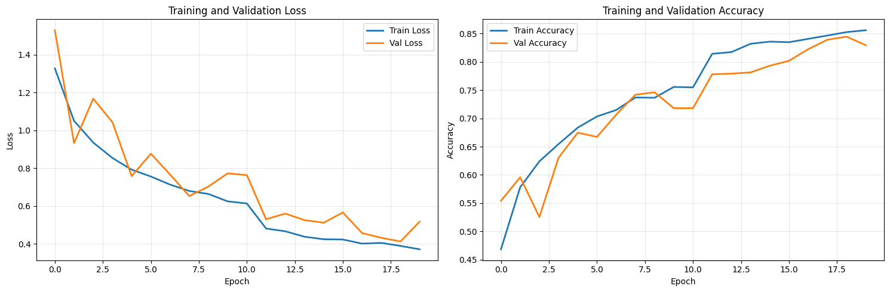
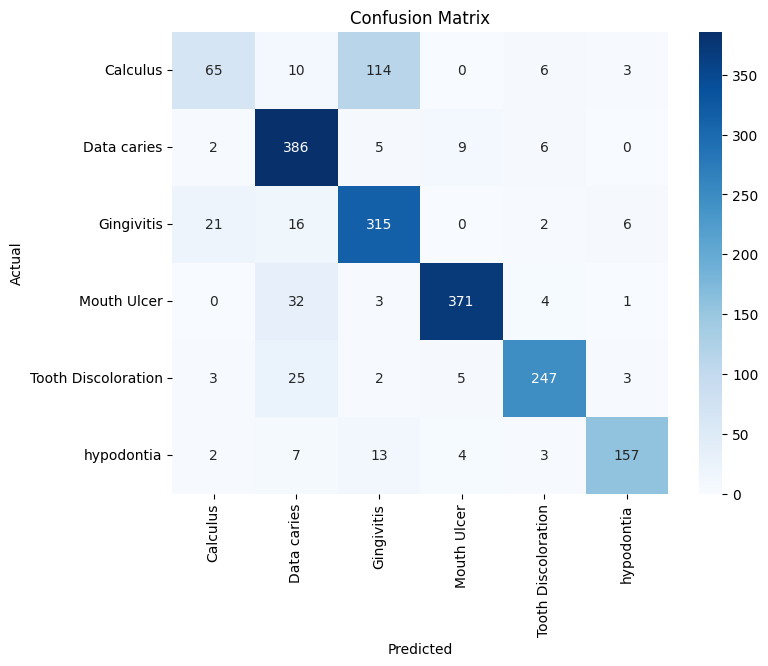

# 🦷 Oral Diseases Detection using Deep Learning

<p align="left">
  
  
  
  
  
</p>

A polished, recruiter-friendly project from dataset cleaning to training a **from-scratch ResNet-50 model** for oral disease classification.
A professional end‑to‑end project for detecting **six major oral diseases** using a deep learning pipeline trained from scratch.

---

## 📌 Project Overview

This repository presents a complete workflow for building an oral disease image‑classification system using the **Dental Condition Dataset** from Kaggle. The dataset includes annotated images across multiple dental conditions such as caries, calculus, gingivitis, ulcers, tooth discoloration, and hypodontia.

My contributions include:

* 🔹 Cleaning and restructuring the dataset into a machine‑learning‑friendly format
* 🔹 Implementing a **ResNet‑50** architecture **from scratch** (PyTorch)
* 🔹 Training the model for 20 epochs with class weighting to handle imbalance
* 🔹 Preparing the code and workflow for reproducibility

---

## 📂 Dataset Summary

**Source:** Kaggle – Oral Diseases / Dental Condition Dataset

### **Included Classes:**

* Caries
* Calculus
* Gingivitis
* Tooth Discoloration
* Ulcers
* Hypodontia

### **Dataset Characteristics:**

* Images annotated with bounding boxes
* Images sourced from dental hospitals & medical websites
* Preprocessed manually (cleaning, flattening, removing YOLO annotations)
* Augmented using rotation, flipping, scaling, and noise

---

## 🧹 Dataset Cleaning & Preparation

The original dataset contained nested folders, mixed annotations, and a YOLO-format dataset that needed to be excluded.

I wrote a full cleaning script to:

* Remove noisy/irrelevant folders
* Flatten class directories
* Prevent filename collisions
* Standardize structure for deep‑learning training

---

## 🧠 Model Architecture

I implemented **ResNet‑50 from scratch**, following the original paper's block structure (Conv → BatchNorm → ReLU → Bottleneck Blocks → Global Pool → FC layer).

### **Training Setup:**

* **Optimizer:** AdamW
* **Learning Rate:** 3e-4
* **Weight Decay:** 1e-4
* **Epochs:** 20
* **Loss Function:** Cross‑entropy with class weighting
* **Device:** CUDA

### **Class Weights Used:**

```
[1.5988, 0.7937, 0.8711, 0.7322, 1.0143, 1.6259]
```

Used to reduce class imbalance and penalize underrepresented classes.

---

## 🚀 Training Pipeline

The training pipeline includes:

* Custom dataset loader for cleaned dataset
* Albumentations transforms for augmentation
* Full ResNet‑50 forward + backward pass
* Logging of loss/accuracy per epoch

---

## 📊 Results

### **📉 Training Curves**

Training and validation trends over 20 epochs:



Below is a summary of model performance after training for **20 epochs** using class weighting.

### **📈 Performance Summary**

Below are the final model evaluation metrics based on the validation set.

| Class                   | Precision | Recall | F1-Score | Support |
| ----------------------- | --------- | ------ | -------- | ------- |
| **Calculus**            | 0.70      | 0.33   | 0.45     | 198     |
| **Data caries**         | 0.81      | 0.95   | 0.87     | 408     |
| **Gingivitis**          | 0.70      | 0.88   | 0.78     | 360     |
| **Mouth Ulcer**         | 0.95      | 0.90   | 0.93     | 411     |
| **Tooth Discoloration** | 0.92      | 0.87   | 0.89     | 285     |
| **Hypodontia**          | 0.92      | 0.84   | 0.88     | 186     |

### **Overall Performance**

* **Accuracy:** 0.83
* **Macro Avg F1:** 0.80
* **Weighted Avg F1:** 0.82

These results indicate strong performance across most classes, particularly Mouth Ulcer, Tooth Discoloration, Hypodontia, and Data Caries.

### **🔍 Confusion Matrix**

Below is the confusion matrix visualizing class‑wise performance:



* Model converged over 20 epochs
* Performance improved significantly with class weighting
* Clean dataset structure reduced noise and improved consistency

---

## 🛠 Tech Stack

* **Python**
* **PyTorch**
* **NumPy / Pandas**
* **Matplotlib**
* **Kaggle Notebooks**


---

## 🧑‍💻 Author

**Abdelrahman Tarek Saad**
Fresh Graduate | Machine Learning & Computer Vision Engineer

---

If you like this project, consider giving the repository a ⭐ on GitHub!
